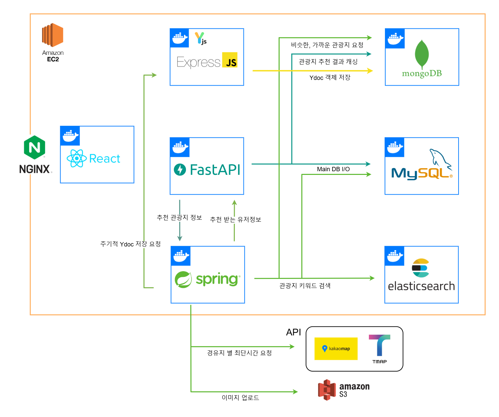

      

 

## 목차

- [목차](#목차)
- [프로젝트 개요](#프로젝트-개요)
- [주요 변경 사항](#주요-변경-사항)
- [주요 기능](#주요-기능)
- [아키텍쳐](#아키텍쳐)
- [기술 스택](#기술-스택)
- [서비스 화면](#서비스-화면)
- [팀원 소개](#팀원-소개)

## 프로젝트 개요

### 서비스 개발 배경
- 대부분의 여행 관련 플랫폼은 개인 사용자를 대상으로 설계되어 있으며, 여러 사용자가 동시에 협업하여 일정을 계획할 수 있는 기능은 제한적입니다.
- ‘TRIPEER’는 실시간 여행 일정 공유 및 계획 플랫폼으로 소통 가능한 맞춤형 여행 계획을 세울 수 있습니다.
- 여행 전 계획 단계부터 여행 중 실시간 조정에 이르기까지 다양한 기능을 제공함으로써 여행의 효율성과 만족도를 높일 수 있습니다.

### 서비스 설명
- 친구, 가족 또는 동료와 같은 여러 참여자가 함께 여행 계획을 수립, 공유, 수정 및 최적화할 수 있는 서비스를 제공합니다.
- 이 플랫폼은 여행 전 계획 단계부터 여행 중 실시간 조정에 이르기까지 다양한 기능을 제공함으로써 여행의 효율성과 만족도를 높일 수 있습니다.
- 주요 기능으로는 협업툴(실시간 채팅 및 마우스 커서 공유) 형태의 일정 공유, Tour API 기반의 여행지 정보 조회, 사용자 성향 기반의 여행지 추천, 네이버 지도를 활용한 지도 제공, 여행기록을 보관할 다이어리를 제공합니다.

### 프로젝트 Version 1 둘러보기
- https://github.com/SSAFY-3rdPJT-Tripeer/Tripeer

## 주요 변경 사항

version1 에서 부터 version2 로 올라오면서 변경된 사항

- FCM 을 활용한 백그라운드/포그라운드 알림 서비스 추가
    - 알림의 종류: 다이어리 작성 알림, 여행 시작일 알림, 초대 알림
    - 알림 목록 조회
- 코드 리팩토링
    - for 루프를 Stream API로 대체하여 가독성과 성능을 개선
    - 정적 팩토리 메소드를 사용하여 toDto, toEntity 등의 변환 메소드를 구현
- 성능 개선
    - N + 1 문제를 해결하기 위해 검색 로직 최적화
    - Elasticsearch를 도입하여 검색 성능을 향상시키고 제목뿐만아니라 지역명, 상세설명으로도 검색가능하게 개선
- 로그인 방식 추가
    - 기존 Google, Kakao, Naver 로그인에 Apple OAuth와 자체 로그인을 추가
- 다양한 최단거리 계산 옵션 제공
    - 기존의 대중교통 옵션(기차, 지하철, 버스)에 항공과 배편을 추가하여 더 다양한 경로 옵션을 제공

## 주요 기능

<table>
<tr>
  <th>분류</th>
  <th>기능</th>
  <th>내용</th>
</tr>
<tr>
  <td> 로그인 및
        랜딩페이지 </td>
  <td>랜딩페이지</td>
  <td>- 트리피어 서비스에 대한 소개 및 로그인 페이지를 보여줍니다.</td>
</tr>
<tr>
  <td></td>
  <td>로그인</td>
  <td>- 소셜 및 트리피어 자체 로그인을 제공합니다.</td>
</tr>
<tr> 
  <td> 홈</td>
  <td> 여행지 검색 </td>
  <td> - 가고싶은 여행지를 검색하거나 추천 여행지 정보를 제공합니다. </td>
</tr>
<tr> 
  <td> </td>
  <td> 여행지 상세 페이지 </td>
  <td> - 특정 여행지에 관한 사진, 리뷰, 지도, 블로그 포스팅을 제공합니다. </td>
</tr>
<tr> 
  <td> </td>
  <td> 지역 필터링 </td>
  <td> - 지역별 및 카테고리별 검색 필터링 기능을 제공합니다. </td>
</tr>
<tr>
  <td> 일정계획 </td>
  <td> 일정 계획 생성</td>
  <td>- 여러 사용자들과 여행 계획을 세우기 위한 플랜을 생성합니다.</td>
</tr>
<tr>
  <td></td>
  <td>채팅 기능</td>
  <td>- 실시간 채팅 및 실시간 멤버별 온라인 여부 조회가 가능합니다. 
  - 데스크탑의 경우, 백틱(``)을 이용해 마우스 커서 공유 및 채팅이 가능합니다.
  </td>
</tr>
<tr>
  <td></td>
  <td>지도 기능</td>
  <td> - 지역별 및 카테고리별 검색 필터링 기능을 제공합니다. 
  - AI기반 실시간 여행지 추천 기능을 제공합니다. 
  - 기상청 API를 활용한 선택 지역의 날씨 정보를 제공합니다.
  - 유저별 상호작용 가능한 여행지 목록 추가기능을 제공합니다.
  - 여행지 선택 시 세부정보 및 지도정보를 제공합니다. 
  </td>
</tr>
<tr> 
  <td> </td>
  <td> 일정 기능</td>
  <td> - 추가된 여행지 목록, 카테고리별, 검색어별 필터링 기능을 제공합니다. 
  - 유저간의 상호작용 가능한 일차별 여행지 드래그 앤 드랍 기능을 제공합니다. 
  - 여행지 간 소요 시간 계산, 교통수단별 최단거리 계산 기능을 제공합니다.
  - 여행지 상세 경로 및 교통 수단에 따른 상세정보를 제공합니다.
  </td>
</tr>
<tr> 
  <td>지난여행 </td>
  <td> 지난 여행 조회</td>
  <td> -다녀온 여행 정보에 대한 열람 기능을 제공합니다.</td>
</tr>
<tr> 
  <td> </td>
  <td> 지난 여행 상세 조회</td>
  <td> -일차별 여행 경로, 지도, 리뷰작성기능을 제공합니다.</td>
</tr>

<tr> 
  <td> 찜 목록</td>
  <td> 찜 몰록 조회 </td>
  <td> -즐겨찾기한 여행지 기반 지역별 및 카테고리별 필터링을 제공합니다.</td>
</tr>
<tr> 
  <td> 마이페이지</td>
  <td> 내 정보 수정 </td>
  <td> -닉네임, 프로필 사진, 여행 스타일 변경이 가능합니다. 
  - 공지사항 열람, 초대 링크, 알림 설정, 로그아웃 설정이 가능합니다.
  </td>
</tr>
<tr> 
  <td> 알림</td>
  <td> 외부 알림 </td>
  <td> -브라우저 알림(데스크탑), 어플리케이션 알림(모바일)을 제공합니다. 
  - 단체 그룹방 초대, 일정 시작, 종료 시 알림 기능을 제공합니다.
  </td>

</tr><tr>
    <td> </td>
  <td> 내부 알림 </td>
  <td> 
  - 단체 그룹방 초대, 일정 시작, 종료 시 알림 기능을 제공합니다.
  </td>
</tr>
</table>

## 아키텍쳐

 

## 기술 스택

> ### BackEnd

 

 

**Language |** Java 21, Python (v3.9.13), Javascript (Node.js 20)

**Library |** SpringSecurity, JWT, OAuth 2.0, yjs, WebSocket, PyTorch

**Framework |** Spring Boot(v3.2.4), Express(v4.19.2), FastAPI(v0.111.0)

**ORM |** Spring Data JPA, Spring Data Elasticsearch

**DB |** MySQL, MongoDB, Elasticsearch

> ### Infra

 
 

 

**CI/CD |** Jenkins(v2.440.3), Docker(v25.0.2)

**Proxy |** Nginx(v1.18.0)

**AWS |** S3, EC2

> ### ETC

**Shortest-Path API |** TMap, KaKaoMap

**Notificaion |** Firebase Cloud Messaging

## 서비스 화면

- 실제 서비스 접근 링크
  - 웹사이트: [트리피어 사이트 링크](https://tripeer.co.kr/)
  - 앱 스토어 링크:
    - iOS 앱: [App Store 링크](https://apps.apple.com/kr/app/%ED%8A%B8%EB%A6%AC%ED%94%BC%EC%96%B4/id6736443613)

## 팀원 소개

<table>
    <tr>
        <td>역할
        <td > 이름
        <td > 역할

  </tr><tr>
    <td rowspan="3"> FrontEnd </td>
    <td>
    부수환</td>
    <td>
      - Yjs 연결을 통한 데이터 실시간 동기화 
      - 페이지 구현(사이트 자체 회원가입, 로그인 페이지, 일정 계획(채팅, 맵, 스케쥴), 찜목록, 마이 페이지, 장소 디테일 페이지 등) 
      - 공통 컴포넌트, 커스텀 훅 개발(공통 모달, 드래그 모달, 맵 적용 커스텀 훅, 무한 스크롤 커스텀 훅, 공통 알림 컴포넌트 등)  
      - 프론트엔드 웹 FCM 알림 기능  
      - 모바일 앱 배포  
    </td>
  </tr><tr>
      <td> 현지혜</td>
    <td> 
        - UI/UX 설계 및 로고제작 
        - 실시간 데이터 동기화 
        - 페이지 구현(랜딩 페이지, 일정계획 맵, 다이어리 페이지 등) 
        - 프로젝트 기획 및 일정 관리 
        - 모바일 앱 배포  
     </td>
  </tr><tr>
      <td> 이해건 </td>
    <td> 
        - 실시간 동기화 데이터 관리 
        - 페이지 구현(홈, 회원등록, 플랜스케쥴 페이지 등) 
        - 모바일 앱 제작 밑 배포(구글 플레이스토어, 애플 앱스토어) 
        - 모바일 FCM 알림 기능 
     </td>
  </tr><tr>
      <td rowspan="3">BackEnd</td>
      <td> 양건우 </td>
    <td> 
      - 서비스 전체 인프라 관리  
      - 파이썬 라이브러리를 활용한 추천로직 구현   
      - ydoc관리를 위한 express서버 구현  
      - 지난 여행 관련 api 구현  
    </td>
  </tr><tr>
      <td> 손동천</td>
    <td> 
      - 소셜 로그인(구글, 네이버, 카카오, 애플) 구현, 유저 회원정보 관리   
      - 민감정보 암호화  
      - 여행 계획 관련 서비스 관리  
      - 최적경로탐색 기능 설계 및 구현  
      - 서비스 에러 핸들링 커스텀  
    </td>
  </tr><tr>
        <td> 김회창 </td>
    <td>
        - FCM 알림 기능 구현 
    </td>
  </tr><tr>
  </tr>
</table>

